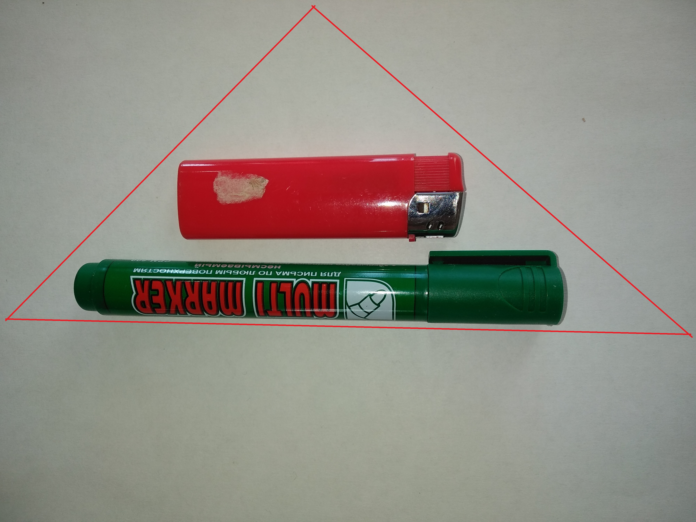

# Intelligent-Placer

## Постановка задачи

Требуется создать “Intelligent Placer”: по поданной на вход фотографии нескольких предметов на светлой горизонтальной поверхности
и многоугольнику понимать, можно ли расположить одновременно все эти предметы на плоскости так, чтобы они влезли в этот многоугольник.
Предметы и горизонтальная поверхность, которые могут оказаться на фотографии, заранее известны. 

## Исходные данные
Исходные данные можно посмотреть по [ссылке](https://github.com/Brahialis0209/Intelligent-Placer/tree/plan-and-data/data/dataset/one)

Требования к этим фотографиям

- Светлый фон
- Отсутсвие шума на изображении
- Предмет не пересекается с краем фонового листа
- Углы и края попадают на фото целиком не перекрываясь
- Освещение должно быть сверху (свет падает вертикально на объект)
- Фотографировать на расстоянии не менее 30 см
- Фотографировать со вспышкой (иначе могут быть тени)

**Пример исходных изображений**

 
 

**Задний фон**

## Входные данные
На вход подаётся фотография c несколькими предметами, описанными выше. Помимо предметов, подаётся многоугольник с обходом по часовой стрелке.
Координаты вершин многоугольника выражены в миллиметрах. 

Требования к многоугольнику:

- Замкнутая линия
- Не более 10 вершин

Входные данные можно посмотреть по [ссылке](https://github.com/Brahialis0209/Intelligent-Placer/tree/plan-and-data/data/dataset/all)

**Пример входных фотографий**

 
 

## Результат работы алгоритма:

True - Предметы можно разместить в многоугольнике  
False - Нет возможности разместить без пересечений предметов

## Разметка входных данных

Вертикальная ось геометрической плоскости направлена вниз.
Горизонтальная -- вправо.

**1. Многоугольник: {[6, 52], [51, 22], [86, 33], [43, 106]}**

Результат: True

**2. Многоугольник: {[13, 50], [35, 5], [87, 20], [108, 43], [80, 85]}**

Результат: False

**3. Многоугольник: {[1, 65], [63, 2], [138, 65]}**

Результат: True

**4. Многоугольник: {[37, 63], [65, 51], [130, 96], [60, 102]}**

Результат: False

**5. Многоугольник: {[4, 32], [45, 8], [93, 60], [72, 102], [45, 102]}**

Результат: True